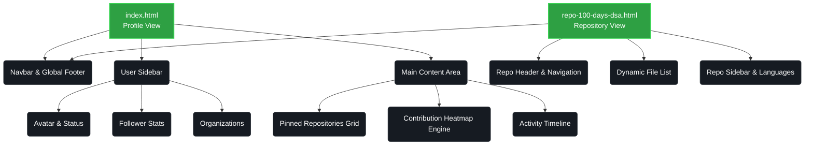
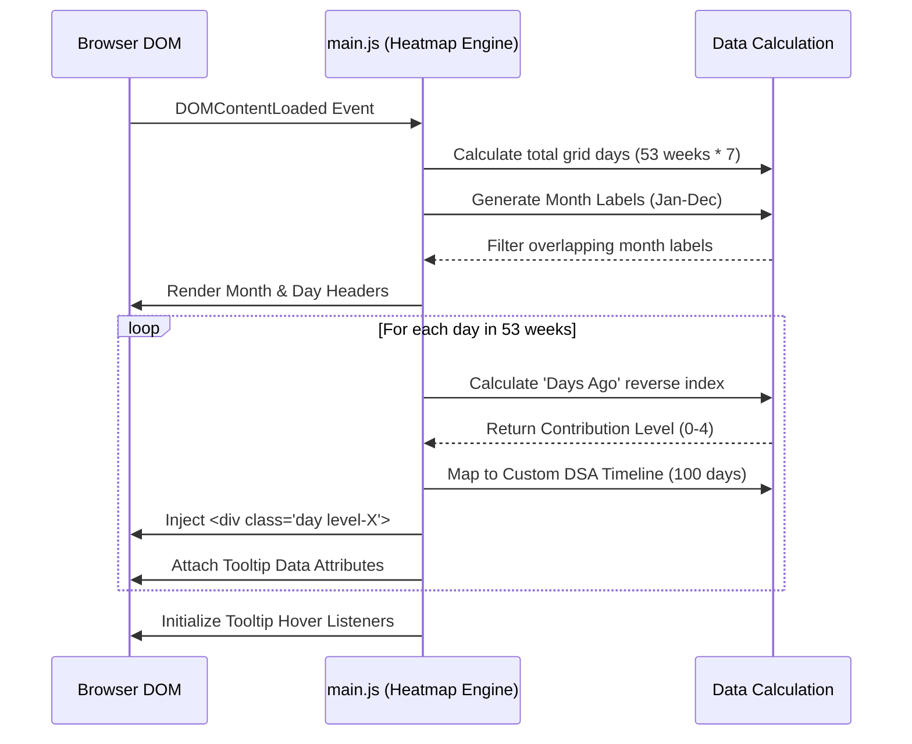
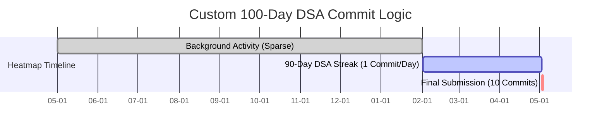

  
  <h1>GitHub Profile UI Clone</h1>
  
<i>A meticulously crafted, high-fidelity front-end clone of the GitHub user profile ecosystem.</i>

  
  
  

---

## 📖 Overview

This project is a pixel-perfect replication of a GitHub profile and repository view. Built entirely from scratch using **Vanilla HTML, CSS, and JavaScript**, it mimics the complex UI layouts, responsive design states, and dynamic data visualization (such as the contribution heatmap) of the actual GitHub platform.

## 🏗️ Component Architecture

The clone is built using a modular component structure to maintain the layout logic across different repository pages.

## 🟩 Dynamic Heatmap Engine (The Core Feature)

Recreating the iconic GitHub contribution graph was the most complex technical hurdle. The 53-week contribution grid is dynamically generated via JavaScript (`main.js`), bypassing the need for static SVGs.

### Rendering Algorithm Flow

## ⏱️ The 100-Day DSA Challenge Schedule

A unique feature of this clone is the custom algorithm that specifically mimics a 100-day Data Structures and Algorithms challenge. The script aligns both the heatmap squares and the commit dates in the repository view.

### Time-Sync Logic
1. **Days 1 to 90:** Generates precisely 1 commit per day, resulting in a continuous, uninterrupted 90-day block of green on the heatmap.
2. **Day 91 (Today):** A massive spike showing exactly **10 commits**, glowing the brightest green (`level-4`).
3. **Repository Sync:** The simulated file list inside `repo-100-days-dsa.html` matches these dates dynamically. Files 1-90 decrement by 1 day, while Files 91-100 all share the "Today" tag.

## 🛠️ The Build Process & Technologies

*   **Custom CSS Variables:** Instead of external frameworks, the styling utilizes deeply nested CSS variables for the GitHub Dark Theme (`--color-canvas-default`, `--color-border-muted`, etc.) ensuring universal color syncing.
*   **Grid & Flexbox:** The heatmap grid relies heavily on `display: grid; grid-auto-flow: column;` to map dates top-to-bottom, left-to-right exactly like the real platform.
*   **Responsive Collapsing:** Employs media queries to collapse the sidebars and stack elements on screens smaller than `768px`.
*   **Native SVG Octicons:** Utilizes raw GitHub SVG paths for pixel-perfect forks, stars, and navigation icons.
*   **`.nojekyll` Bypass:** A hidden configuration file ensures GitHub Pages serves the raw custom code without attempting to process it through the Jekyll static site generator.

## 🚀 How to Run Locally

Because this project uses vanilla frontend technologies, you do not need `npm`, `node`, or a local server to view it.

1. Clone or download this repository to your machine.
2. Open `index.html` directly in Chrome, Firefox, or Safari.
3. Click through the repositories (like `100-days-dsa.html`) to see the dynamic file rendering.

---

  
<i>Disclaimer: This is a purely frontend UI clone created for educational and design practice purposes. It is not affiliated with GitHub, Inc.</i>

